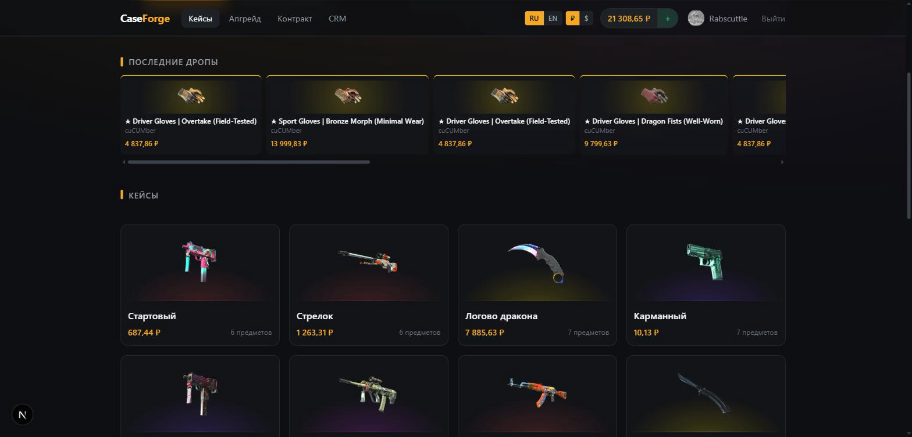
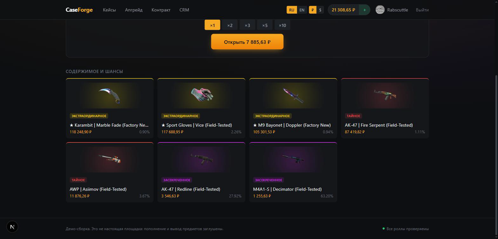
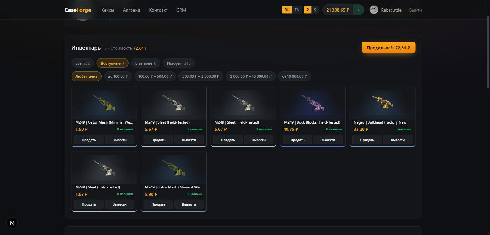
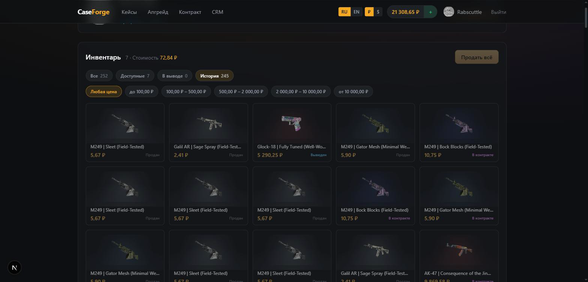
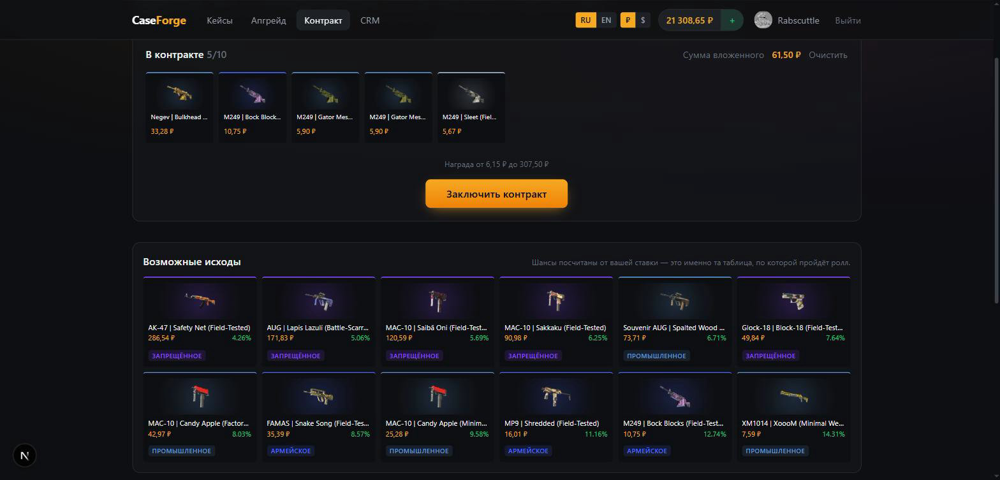
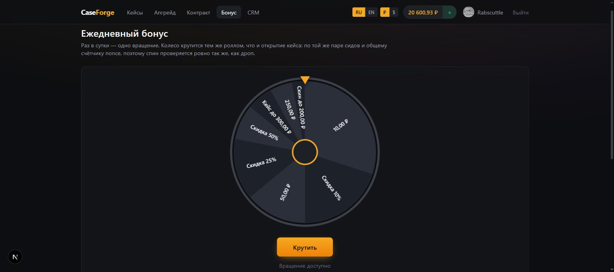

<h1 align="center">CaseForge</h1>

<p align="center">
  <b>An open-source CS2 case-opening platform.</b><br>
  Steam sign-in, provable fairness, an RTP-balanced case builder,<br>
  item withdrawal through a farm of Steam bots and an admin CRM.
</p>

<p align="center">
  <a href="https://github.com/ialakey/caseforge/actions/workflows/ci.yml"></a>
  <a href="LICENSE"></a>
  
  
  <a href="README.ru.md"></a>
</p>

---

Every piece of the loop is here and working: a player signs in with Steam, opens
a case, watches the reel stop on a real item, sells it back or upgrades it, and
requests a withdrawal that a Steam bot actually delivers. The odds are provably
fair and re-verifiable in the browser, item prices come from the Steam market,
and the back office computes margin per case before it goes live.

The stack and the architectural decisions are covered in
[docs/ARCHITECTURE.md](docs/ARCHITECTURE.md).


<p align="center">
  
</p>

<p align="center">
  <em>The catalogue and the live drop feed. Prices come from the Steam market; the language and currency switches sit in the header.</em>
</p>

<p align="center">
  
</p>

<p align="center">
  <em>Every case publishes its contents: rarity, current price and the exact chance of each item. The odds are the ticket ranges the server rolls against, not a marketing figure.</em>
</p>

---

## Stack

| | |
|---|---|
| `apps/web` | Next.js 15 (App Router), React 19, Tailwind, Zustand, socket.io-client |
| `apps/api` | NestJS 11 on Fastify, Prisma 6, Postgres 16, Redis 7, BullMQ, socket.io |
| `apps/bot` | Node worker: the Steam bot farm and the withdrawal queue consumer |
| `packages/shared` | shared types, zod schemas, translations, ticket logic and provable fairness |

Why TypeScript, and why the trading layer has to run on Node, is covered in
section 1 of the architecture document.

---

## Quick start

Requires Node ≥ 22, pnpm 11 and Docker.

```bash
cp .env.example .env       # no editing needed for a local run
pnpm setup                 # install + docker + shared build + migrations + seed
pnpm dev                   # api on :4000, web on :3000
```

`pnpm setup` runs, in order:

```bash
pnpm install
pnpm infra:up                              # Postgres :5433, Redis :6380
pnpm --filter @caseforge/shared build      # api and web import the built output
pnpm db:migrate
pnpm db:seed                               # only the demo administrator and their seed pair
```

Ports 5433 and 6380 are deliberately non-standard so they do not clash with a
locally installed Postgres or Redis.

The catalogue of 20 themed cases is populated by a separate command. It talks to
Steam and therefore takes about ten minutes:

```bash
pnpm seed:cases
```

Contents are not hard-coded by name: items are picked by searching the market,
so each one is guaranteed to have an image and a real price. From there a case
is assembled the same way it would be by hand in the CRM — auto-balanced to a
target RTP and saved through the same validation.

`db:seed` deliberately creates neither items nor cases. It used to, with guessed
prices, and that turned out to be a trap: after the very first sync the real
Steam prices differed by an order of magnitude, cases went into loss, and
re-running the seed silently overwrote fixes made in the CRM.

### Verification

```bash
pnpm test          # unit tests: provable fairness, ticket ranges, balancing, upgrade odds
pnpm typecheck     # every package
pnpm test:smoke    # end-to-end run against a live API
```

`test:smoke` needs the infrastructure up and the API running. It covers what
unit tests cannot: the atomicity of the balance debit, that the active server
seed never leaks, that an opening recomputes after rotation, that the balance
agrees with the ledger, that roles keep the admin panel closed, that every item
in an active case has an image and a Steam-confirmed price, and that the server
refuses a loss-making case and a case with a gap in its ticket ranges.

### If a case turns red on RTP

Item prices drift, and a case assembled at 90% can wander off. Recovery is two
clicks in the builder: **Fit price to RTP**, then **Solve the odds**, then save.

---

## Language and currency

Two switches in the header: **RU / EN** and **₽ / $**.

With no stored preference the language follows the browser, and the currency
follows the language. Both choices are remembered in `localStorage`.

The currency switch is **display only**. Everything is settled in roubles:
balances, item prices and case prices are stored as integer minor units of the
base currency, and no ledger entry ever holds a converted amount. The dollar
figure is that same number divided by the exchange rate at render time. Treating
a display rate as a settlement rate is how a site ends up selling items below
cost after a currency move.

The rate comes from the Central Bank of Russia's public daily feed — no key, no
quota — refreshed every six hours and cached in Redis. If the feed is
unreachable, the previous rate keeps being served: a stale rate beats a broken
price list.

Interface strings live in one dictionary in `packages/shared/src/i18n.ts`.
Server errors carry a machine-readable `code` alongside an English `message`;
the interface translates the code and falls back to the message for codes a
build does not know yet, so an error added on the backend stays readable before
its translation lands.

Case names are content, not interface text, so they live in the database: each
case has a base name and an optional English one, both editable in the builder.
The CRM itself is English only — translating an internal tool doubles the
maintenance for an audience of a few people.

---

## What already works

- Steam OpenID 2.0 sign-in with server-side verification; the avatar and
  nickname are pulled without a Web API key, through the public profile XML
- **Russian and English interface** with a language switch, and prices in
  roubles or dollars with a currency switch
- **balance top-up** through a stub (demo mode, disabled by a flag)
- **case builder in the CRM**: Steam market search, import with image, rarity
  and price, a case image, auto-solved odds for a target RTP, a live margin verdict
- **prices and images from Steam**: hourly synchronisation, RTP recalculation for
  every active case, a warning about prices Steam never confirmed
- **CS-style opening animation**: a reel of items decelerating under a marker,
  the winner highlighted while the rest dim
- **up to 10 cases opened at once**: one reel per case, stopping in sequence
- **instant sale of a drop** straight from the results panel, per item or all at once
- **upgrade**: stake your skin against a pricier one, with the chance derived
  from the price ratio
- **contracts**: trade 3 to 10 items for one, over a reward table solved so the
  expected payout is the same 90% the cases run on
- **a daily bonus wheel**: one spin a day for money, a discount, a free opening
  or a skin, rolled from the same seed pair as everything else
- **promo codes on a top-up**: percentage or flat, with per-code and per-player
  limits, created in the back office
- **runtime settings**: limits, fees, the top-up bounds and the wheel itself are
  edited in the panel and take effect without a deploy
- provable fairness: seed pairs, rotation with reveal, and re-verification **in
  the browser** by an independent Web Crypto implementation
- case opening in a single transaction with an atomic debit and nonce reservation
- site inventory: filters by state and price band, selling one item or
  everything on screen at once behind a confirmation, and a withdrawal stub
- nothing is ever deleted from the inventory — a sold, withdrawn or staked item
  keeps its row and changes status, so the history stays readable
- a live drop feed over Redis Pub/Sub, batched every 300 ms
- withdrawal requests: item locking, a BullMQ queue, idempotency by request id
- the bot worker: bot login, an inventory mirror, trade offers, hold checks, status polling
- CRM: a GGR dashboard, per-case margin, a case builder with range validation and
  RTP calculation, balance adjustments through the ledger, an audit log
- nightly reconciliation of balances against the transaction ledger

## What is not there yet

Stage 1 of the roadmap (section 14 of the architecture document). Not
implemented: payments, item deposits, case battles, promo codes, KYC.

---

## Configuration

The canonical `.env` lives at the monorepo root — api, bot and prisma all read it.

What actually needs filling in before a production run:

| Variable | Why |
|---|---|
| `JWT_ACCESS_SECRET`, `JWT_REFRESH_SECRET` | `openssl rand -hex 32` each |
| `STEAM_API_KEY` | https://steamcommunity.com/dev/apikey. Without it the profile falls back to the public XML; sign-in works either way |
| `BOT_SECRETS_KEY` | `openssl rand -hex 32`, exactly 64 hex characters. Encryption key for bot secrets |
| `BOOTSTRAP_ADMIN_STEAM_ID` | your SteamID64: that account gets the ADMIN role on first sign-in |
| `ENABLE_STUB_DEPOSITS` | `true`/`false`. The stub top-up. On by default in development, **off in production**, enabled only by an explicit `true` |

---

## Profile and balance

After signing in, the header shows the Steam avatar and nickname; the profile
page adds a card with the SteamID and a link to the Steam profile, a trade URL
field and the history.

The session survives the access token. The token is short-lived on purpose, and
the browser renews it against the refresh cookie the moment a call comes back
401, retrying the original request once. A player who leaves a tab open over
lunch comes back signed in; only a refresh that itself fails ends the session.

The trade URL is checked against the account: `partner` in it is the low 32 bits
of the SteamID64, and somebody else's link is rejected before a withdrawal could
follow it.

Items are never deleted from the inventory. Selling, withdrawing or staking one
moves it to another status and it stays on the account as a record of what
happened — a player who sold a knife can still find it and see what they got for
it. The tabs split the inventory by what the player is looking for, and the price
bands narrow it further.

<p align="center">
  
</p>

<p align="center">
  <em>Available items, filtered by state and price band. Selling everything on screen asks for confirmation and names the amount first.</em>
</p>

<p align="center">
  
</p>

<p align="center">
  <em>The same inventory on its history tab: sold, withdrawn and staked items keep their row and carry the status that explains where they went.</em>
</p>

**Withdrawal from the inventory is a stub.** It marks the item withdrawn and does
nothing else — no bot, no trade offer, no queue. The real path is the withdrawals
module described further down, and it is untouched by it.

**Top-up is a stub.** The button credits the entered amount with no payment at
all. It exists so the gameplay loop can be exercised before a payment provider
is wired in. The credit still goes through `Transaction`, so the nightly balance
reconciliation stays correct. The real flow will be different: an invoice at a
PSP, a redirect, and a balance change only on a payment webhook, idempotent by
payment id. In production the stub is off by default.

---

## Upgrade

`/upgrade` — the player stakes a skin against a pricier one: win and they get
the expensive item, lose and they forfeit their own.

The chance is not set by hand but derived from prices:
`chance = stake / target × 90%`. The same 90% the cases run on, so the upgrade
lives in one economy with them instead of becoming a separate game with its own
maths. The expected value works out to exactly `90%` of the stake at any
multiplier — there is a test for that.

Bounds: the target must be at least 1.05x pricier (below that it is a swap with
a fee, not an improvement), the chance is capped at 85%, and an excessive price
gap is rejected. The range of available targets is computed with the same
formula as the chance, so the list never offers an option the server will refuse.

The outcome comes from the same roll as a case opening — the same seed pair and
the shared `nonce` counter. The upgrade needs no fairness page of its own: it is
verified exactly the same way.

---

## Contracts

`/contract` — the player throws between 3 and 10 items in and gets exactly one
back. Unlike an upgrade there is no losing branch: a contract always pays out,
the only question is what.

<p align="center">
  
</p>

<p align="center">
  <em>The staked items, the reward band they imply, and the table the roll will actually run against — every outcome with the chance the server computed for it.</em>
</p>

The table is not authored by hand. Rewards are drawn from the catalogue in a band
of 0.1x to 5x the staked sum, and the weights are solved so the expected reward
equals `stake × 90%` — the same margin the cases and the upgrade run on. The
weights follow an exponential tilt over the pool, with the exponent found by
bisection. The point of the construction is that the margin becomes a constant of
the system rather than a property of whatever happens to be priced inside the
band.

The solved table is snapshotted onto the contract row. The pool comes from a live
catalogue and cannot be rebuilt later from prices that have since moved — without
the snapshot the roll would stay reproducible but would no longer mean anything.

---

## Daily bonus

`/bonus` — one spin of the wheel every 24 hours. The prizes are money, a cut off
the next opening, a free opening up to a price ceiling, or a skin.

<p align="center">
  
</p>

<p align="center">
  <em>The wheel is a ticket table like a case, and the slices are drawn from the very ranges they are rolled against — the 30% prize takes up 30% of the rim and the 3% one is a sliver.</em>
</p>

The wheel is not a game of its own. It is a ticket table exactly like a case,
rolled from the same seed pair and the same shared `nonce` counter, so a spin is
checked the way a drop is. The slices are drawn in proportion to their real
ticket ranges, which is why the rare ones look thin.

The cooldown is a rolling day rather than a calendar one — a calendar reset hands
whoever lives in the right timezone two spins a few hours apart. It is claimed
with a conditional `UPDATE` rather than read and then written: between a read and
a write, two requests fired together both pass the check.

Money and skins are settled the moment the wheel stops. A discount and a free
opening are vouchers: they sit on the account until an opening spends them. An
opening takes whichever voucher saves the most on that particular basket — a
first-in-first-out queue would burn a half-price voucher on the cheapest case in
the catalogue while a free opening sat behind it — and says which one it spent,
so a reward never disappears without explanation.

---

## Promo codes

Created in the back office at `/admin/promo`. A code is a percentage of the
top-up or a flat credit, with an optional minimum top-up, a cap on the bonus, a
total number of uses and a per-player limit.

A code **adds to** the top-up rather than discounting it. That matters once a
real payment provider is behind the button: the sum charged has to be the sum
the provider was told about, and a code that changed it would put the two out of
step. Adding on top keeps the whole promotion on our side of the transaction.

The bonus is its own ledger row rather than being folded into the deposit. What
the player paid and what the promotion gave them are different kinds of money,
and a report that cannot tell them apart cannot measure what the promotion cost.

Limits are enforced with a conditional `UPDATE` on the counter rather than by
counting rows and then writing: between a count and an insert, two top-ups fired
together both see the last use available and both take it.

---

## Runtime settings

`/admin/settings`. Maintenance mode, the top-up bounds, the sell-back fee, the
opening rate limit, the wheel's cooldown and the wheel's own slices are stored in
the database and read at request time, so changing one is a save rather than a
deploy.

The form is generated from a registry declared once in
`packages/shared/src/settings.ts` — each setting names its group, its type, its
bounds and its default. Adding a knob is a line in that file; the admin panel
picks it up with no change of its own.

**What is deliberately not configurable:** the ticket space, the seed algorithm
and the shape of a roll. Those are not tuning parameters but the terms of a
promise — every past opening was published against them, and an operator able to
edit them could make yesterday's drops stop verifying.

---

## Working with cases in the CRM

`/admin/cases` lists the cases with their RTP and margin; `/admin/cases/new`
opens the builder.

How a case is assembled:

1. **Search for an item** on the Steam market, right inside the builder. Results
   are cached for an hour: Steam throttles requests.
2. **Add it** — the item is imported into the catalogue together with its image,
   rarity and price in the settlement currency.
3. **Balance** — set a target RTP and press *Solve the odds*: ticket ranges are
   laid out so the expected return matches the target, the pricier the item the
   rarer it is. *Fit price to RTP* solves the inverse problem, computing the case
   price for the odds already set.
4. **Save** — the server independently recomputes the RTP from database prices
   and refuses the case if the return exceeds 98% or the ranges do not tile the
   ticket space.

The balancing model: an item's weight is inversely proportional to its price
raised to `k`, and `k` is found by binary search against the target RTP. The
achievable RTP range is bounded by the cheapest and priciest item — if the
target falls outside it, the builder says what to change.

A separate check covers **unconfirmed prices**. An item whose price Steam never
returned (no listings, a wrong name) keeps whatever number was put into it by
hand, yet counts towards the RTP like any other. Such items are flagged both in
the case list and in the builder.

One detail about names: knives and gloves carry a `★` prefix on the market
(`★ Karambit | Marble Fade (Factory New)`). Without the star Steam does not know
the item, and neither the price nor the image will resolve.

---

## Steam bots

A bot is a separate Steam account with the mobile authenticator enabled.
`shared_secret` and `identity_secret` come from the maFile; without them offers
cannot be auto-confirmed.

```bash
cd apps/bot
BOT_STEAM_ID=7656119... BOT_USERNAME=... BOT_PASSWORD=... \
BOT_SHARED_SECRET=... BOT_IDENTITY_SECRET=... \
pnpm add-bot
```

Secrets are never stored in the clear: the script encrypts them with AES-256-GCM
under `BOT_SECRETS_KEY`, and they are decrypted only inside the bot worker.

The constraints the withdrawal logic is built around (details in section 7.4 of
the architecture document): a Steam inventory holds 1000 slots, a trade hold of
up to 15 days applies to a recipient without a mobile authenticator, and Valve
rate-limits offer creation.

---

## Layout

```
apps/
  api/
    prisma/schema.prisma     data model, money as integer minor units
    prisma/seed.ts           the administrator only; the catalogue comes from Steam
    src/auth/                Steam OpenID + JWT
    src/cases/               case opening — the core of the project
    src/upgrade/             upgrade: odds, roll, stake consumption
    src/contracts/           contracts: solved outcome table, roll, reward
    src/bonus/               the daily wheel: cooldown, roll, vouchers
    src/promo/               promo codes: rules, preview, redemption
    src/inventory/           inventory: filters, selling, the withdrawal stub
    src/drops/               batched WebSocket feed
    src/withdrawals/         withdrawal requests and queueing
    src/admin/               CRM: reports, case builder, audit
    src/steam/               OpenID, the Steam market, price and image sync
    src/common/              config, Prisma, Redis, FX rates, roles, nightly reconciliation
    test/smoke.mjs           end-to-end run against a live API
  bot/
    src/crypto.ts            bot secret encryption
    src/steam-bot.ts         wrapper over steam-user / steamcommunity / tradeoffer-manager
    src/bot-pool.ts          the farm: who can hand out which items
    src/withdrawal-processor.ts  idempotent request handling
    scripts/add-bot.ts       bot registration
  web/
    src/app/                 home, case, upgrade, contract, bonus, profile, CRM, Steam callback
    src/app/admin/cases/     case list and builder
    src/components/          drop feed, opening reel, cards, switches
    src/lib/                 API client, auth store, settings store, socket
packages/
  shared/
    src/i18n.ts              interface dictionary, RU and EN
    src/errors.ts            error codes shared by the API and the interface
    src/money.ts             minor units, display currencies, formatting
    src/tickets.ts           ticket space, range validation, RTP
    src/balancing.ts         auto-solved odds for a target RTP, margin verdict
    src/upgrade.ts           upgrade odds and bounds
    src/contract.ts          contract reward table: the tilt and its solver
    src/bonus.ts             the wheel: slices, ticket ranges, cooldown
    src/promo.ts             promo code rules and what one is worth
    src/settings.ts          the settings registry: types, bounds, defaults
    src/inventory.ts         inventory statuses, filters and price bands
    src/steam-market.ts      market response parsing: prices, rarity, images
    src/provably-fair.ts     server-side cryptography (node:crypto)
    src/verify.ts            in-browser re-verification (Web Crypto)
```

`@caseforge/shared` is split on purpose: the main entry point is isomorphic and
the server-side cryptography sits behind the `@caseforge/shared/node` subpath.
Otherwise `node:crypto` ends up in the browser bundle and the front-end build
fails.

---

## Legal note

Buying cases with real money is regulated as gambling in most jurisdictions:
a licence, KYC, age verification and country restrictions are all required.
That has to be settled before payments go live — section 13 of the architecture
document.

---

## Contributing

Issues and pull requests are welcome — see [CONTRIBUTING.md](CONTRIBUTING.md)
for how to get the project running and what the review looks for.

## License

[MIT](LICENSE). Do what you like with it; the legal note above still applies to
running it for real money.
