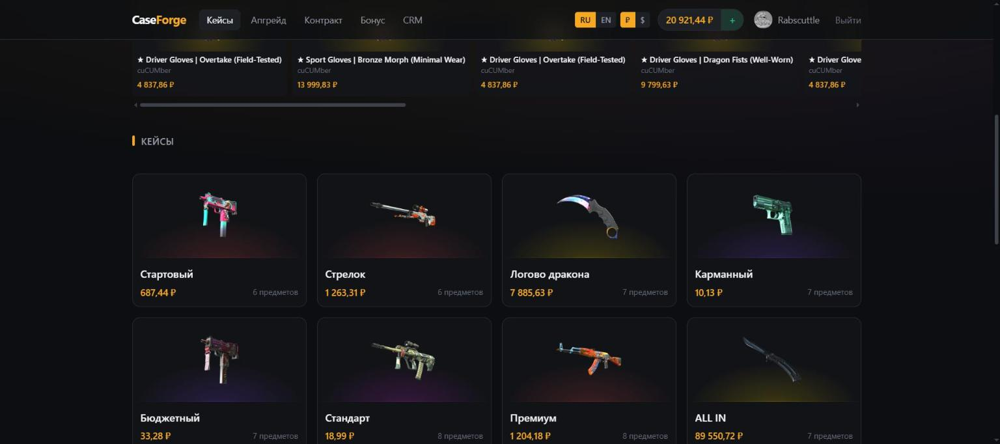
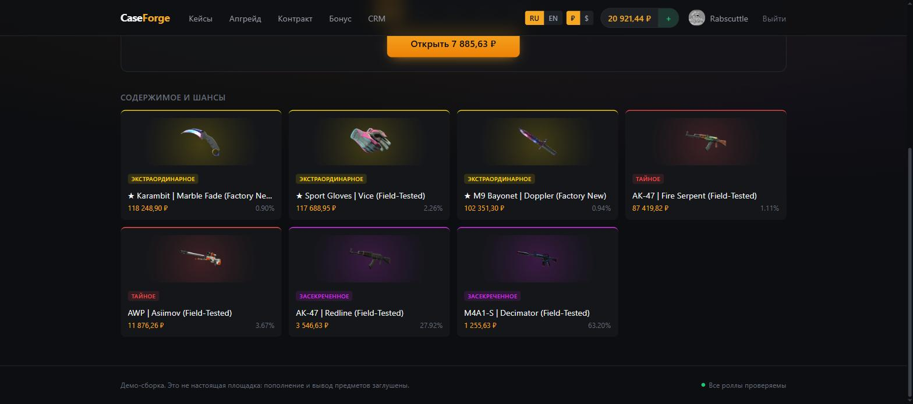
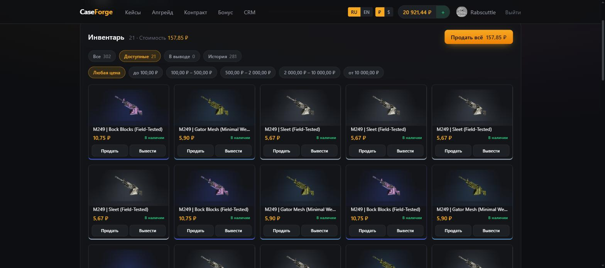
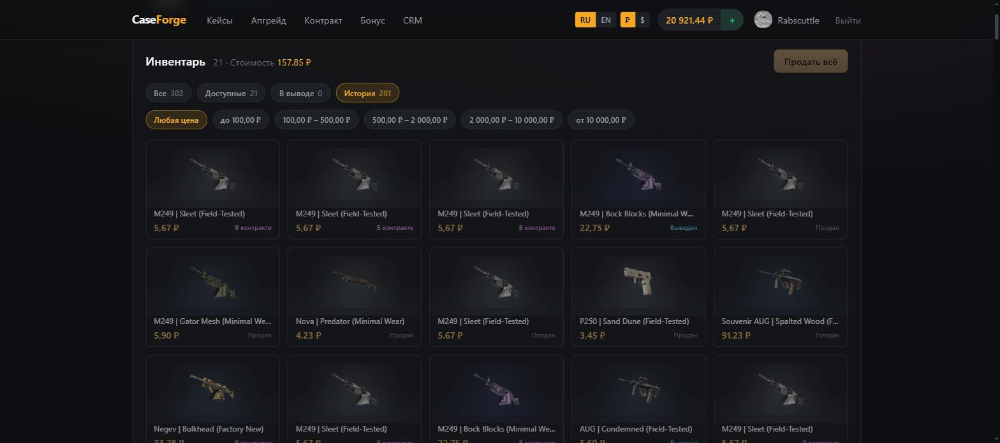
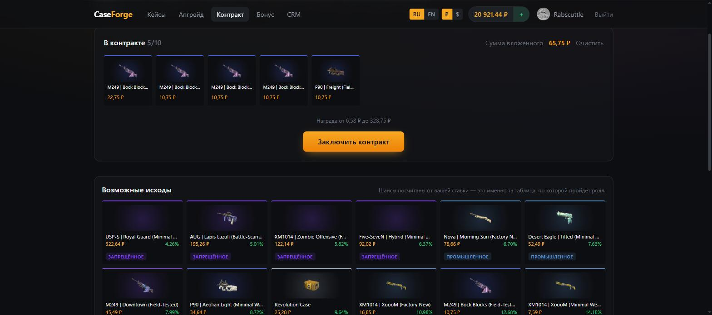
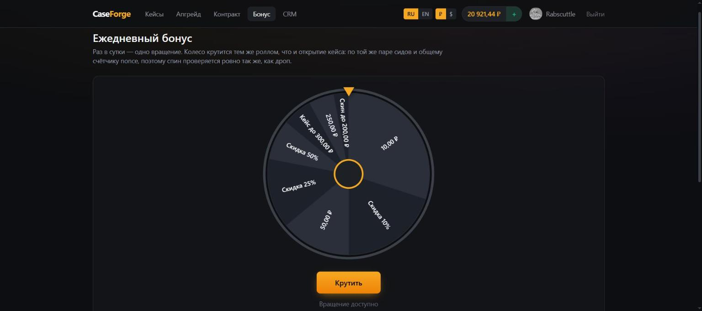
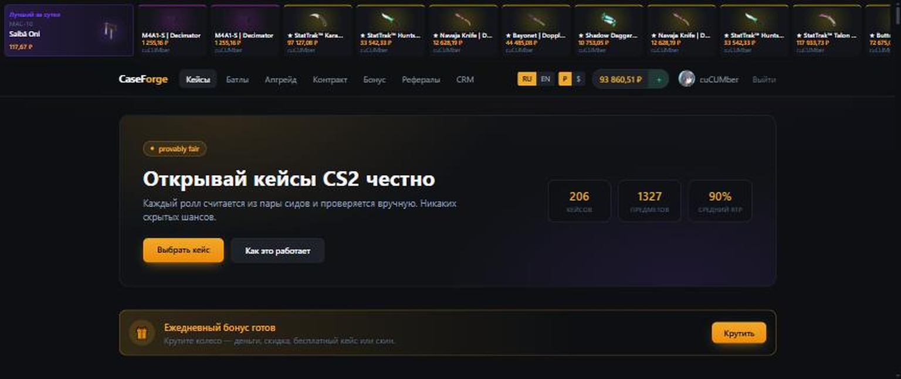
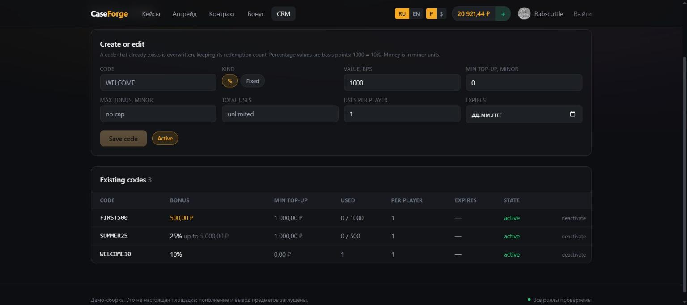
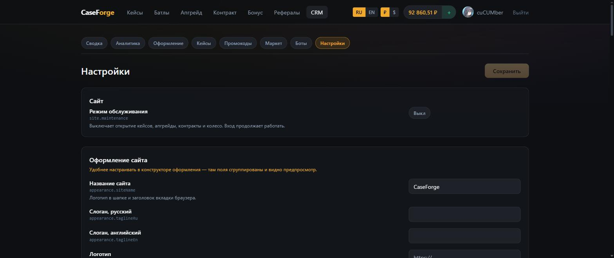

<h1 align="center">CaseForge</h1>

<p align="center">
  <b>Открытая платформа для сайта с кейсами CS2.</b><br>
  Steam-авторизация, provably fair, конструктор кейсов с балансировкой по RTP,<br>
  вывод предметов покупкой на market.csgo.com и CRM-админка.
</p>

<p align="center">
  <a href="https://github.com/ialakey/caseforge/actions/workflows/ci.yml"></a>
  <a href="LICENSE"></a>
  
  
  <a href="README.md"></a>
</p>

---

Игровой цикл собран целиком и работает: игрок входит через Steam, открывает
кейс, смотрит, как лента останавливается на реальном предмете, продаёт его
обратно или апгрейдит, а затем заказывает вывод: скин покупается на
market.csgo.com и продавец присылает его прямо на трейд-ссылку игрока. Шансы
доставляет. Шансы честны по схеме provably fair и перепроверяются прямо в
браузере, цены предметов берутся с торговой площадки Steam, а админка считает
маржу по каждому кейсу до его публикации.

Разбор стека и архитектурные решения — в [docs/ARCHITECTURE.ru.md](docs/ARCHITECTURE.ru.md).


<p align="center">
  
</p>

<p align="center">
  <em>Каталог и лента последних дропов. Цены берутся с торговой площадки Steam, переключатели языка и валюты — в шапке.</em>
</p>

<p align="center">
  
</p>

<p align="center">
  <em>Каждый кейс публикует содержимое: редкость, текущую цену и точный шанс по каждому предмету. Это те самые диапазоны билетов, по которым бросает сервер, а не маркетинговая цифра.</em>
</p>

---

## Стек

| | |
|---|---|
| `apps/web` | Next.js 15 (App Router), React 19, Tailwind, Zustand, socket.io-client |
| `apps/api` | NestJS 11 на Fastify, Prisma 6, Postgres 16, Redis 7, BullMQ, socket.io |
| `apps/bot` | Node-воркер: обработка очереди выводов — покупки на маркете и ферма Steam-ботов |
| `packages/shared` | общие типы, zod-схемы, переводы, тикет-логика и provably fair |

Почему именно TypeScript и почему торговый слой обязан быть на Node — раздел 1
архитектурного документа.

---

## Быстрый старт

Нужны Node ≥ 22, pnpm 11 и Docker.

```bash
cp .env.example .env       # заполнять для локального запуска не обязательно
pnpm setup                 # install + docker + сборка shared + миграции + сид
pnpm dev                   # api :4000, web :3000
```

`pnpm setup` — это последовательно:

```bash
pnpm install
pnpm infra:up                              # Postgres :5433, Redis :6380
pnpm --filter @caseforge/shared build      # api и web импортируют dist
pnpm db:migrate
pnpm db:seed                               # только демо-админ и его пара сидов
```

Каталог из 20 тематических кейсов наполняется отдельной командой — она ходит
в Steam и потому идёт около десяти минут:

```bash
pnpm seed:cases
```

Составы не хардкодятся именами: предметы подбираются поиском по маркету, так что
у каждого гарантированно есть картинка и настоящая цена. Дальше кейс собирается
тем же путём, что и руками в CRM — автобалансом под целевой RTP, с сохранением
через ту же валидацию.

Порты 5433/6380 выбраны намеренно нестандартными, чтобы не конфликтовать
с локально установленными Postgres и Redis.

### Проверка

```bash
pnpm test          # юнит-тесты provably fair и тикет-диапазонов
pnpm typecheck     # все пакеты
pnpm test:smoke    # сквозной прогон против запущенного API
```

`test:smoke` требует поднятой инфраструктуры и работающего API. Он проверяет то,
что юнит-тестами не поймать: атомарность списания баланса, что активный серверный
сид не утекает наружу, что после ротации открытие пересчитывается, что баланс
сходится с журналом транзакций, что роли закрывают админку, что у всех предметов
в активных кейсах есть картинка и подтверждённая Steam цена, и что сервер
отбивает убыточный кейс и кейс с дырой в тикет-диапазонах.

`db:seed` намеренно не создаёт ни предметов, ни кейсов. Раньше создавал —
с прикидочными ценами, и это оказалось ловушкой: после первой же синхронизации
реальные цены Steam расходились с выдуманными в десятки раз, кейсы уходили
в убыток, а повторный прогон сида молча затирал исправления, сделанные в CRM.
Каталог наполняется из Steam командой `pnpm seed:cases`.

### Если кейс покраснел по RTP

Цены предметов плавают, и кейс, собранный при 90%, со временем может уехать.
Порядок восстановления — два клика в конструкторе:
**«Подобрать цену под RTP»**, затем **«Рассчитать шансы»**, сохранить.

---

## Язык и валюта

Два переключателя в шапке: **RU / EN** и **₽ / $**.

Если выбор ещё не сохранён, язык берётся из браузера, а валюта — из языка.
Оба выбора запоминаются в `localStorage`.

Переключатель валюты меняет **только отображение**. Расчёты идут в рублях:
балансы, цены предметов и цены кейсов хранятся целыми минорными единицами
базовой валюты, и ни одна запись журнала никогда не содержит конвертированную
сумму. Долларовая цифра — то же самое число, делённое на курс в момент
отрисовки. Принять курс отображения за расчётный — это как раз тот путь,
на котором сайт начинает продавать предметы ниже себестоимости после движения
валюты.

Курс берётся из публичной ежедневной выгрузки ЦБ РФ — без ключа и без квот, —
обновляется раз в шесть часов и кэшируется в Redis. Если выгрузка недоступна,
продолжает отдаваться прежний курс: устаревший курс лучше сломанного прайса.

Строки интерфейса лежат в одном словаре `packages/shared/src/i18n.ts`.
Ошибки сервера несут машинно-читаемый `code` рядом с английским `message`:
интерфейс переводит код и откатывается на сообщение для кодов, которых сборка
ещё не знает, — так добавленная на бэкенде ошибка остаётся читаемой до того,
как появится её перевод.

Названия кейсов — это контент, а не текст интерфейса, поэтому они живут в базе:
у каждого кейса есть базовое название и необязательное английское, оба
редактируются в конструкторе. Сама CRM только на английском — переводить
внутренний инструмент значит удвоить поддержку ради нескольких человек.

**Код, комментарии и документация — на английском.** Русскими остаются только
русский словарь переводов, названия кейсов в базе и примеры вывода Steam
в тестах.

---

## Что уже работает

- вход через Steam OpenID 2.0 с серверной верификацией ответа; **аватар и ник
  из Steam** подтягиваются без ключа Web API — через публичный XML профиля
- **русский и английский интерфейс** с переключателем языка, цены в рублях
  или долларах с переключателем валюты
- **пополнение баланса** заглушкой (демо-режим, выключается флагом)
- **конструктор кейсов в CRM**: поиск предметов по маркету Steam, импорт с картинкой,
  редкостью и ценой, картинка кейса, автоподбор шансов под целевой RTP,
  live-вердикт по марже
- **цены и картинки из Steam**: почасовая синхронизация, пересчёт RTP всех активных
  кейсов, предупреждение о неподтверждённых ценах
- **анимация открытия как в CS**: барабан с лентой предметов, торможение под маркером,
  выигрыш подсвечивается, остальные ячейки гаснут
- **открытие до 10 кейсов за раз**: своя лента на каждый кейс, останавливаются по очереди
- **мгновенная продажа дропа** прямо из окна результатов, поштучно или всё сразу
- **апгрейд**: ставка своего скина против более дорогого, шанс выводится из отношения цен
- **контракты**: обмен от 3 до 10 предметов на один по таблице исходов,
  решённой так, что матожидание выплаты — те же 90%, что и в кейсах
- **колесо ежедневного бонуса**: одно вращение в сутки на деньги, скидку,
  бесплатное открытие или скин, роллится по той же паре сидов
- **промокоды на пополнение**: процент или фиксированная сумма, с лимитами на
  код и на игрока, создаются в админке
- **настройки в рантайме**: лимиты, комиссии, границы пополнения и само колесо
  правятся в панели и применяются без деплоя
- весь интерфейс, **включая админку**, переключается между русским и английским
  из шапки — вместе с подписями настроек и вердиктом по RTP
- provably fair: сид-пары, ротация с раскрытием, перепроверка **в браузере**
  независимой реализацией на Web Crypto
- открытие кейса одной транзакцией с атомарным списанием и резервированием nonce
- инвентарь сайта: фильтры по состоянию и ценовому диапазону, продажа одного
  предмета или сразу всего на экране с подтверждением, вывод
- из инвентаря ничего не удаляется — проданный, выведенный или вложенный предмет
  сохраняет строку и меняет статус, поэтому история остаётся читаемой
- лента дропов в реальном времени через Redis Pub/Sub, с батчингом раз в 300 мс
- заявки на вывод: блокировка предметов, очередь BullMQ, идемпотентность по id заявки
- **вывод через market.csgo.com**: пул аккаунтов покупает каждый скин, продавец
  отдаёт его игроку; потолок цены задаёт оператор, ключ идемпотентности
  переживает потерянный ответ, доставка отслеживается по каждому предмету, а
  троттлинг по ключу не даёт лимиту маркета стоить вам ключа
- ферма ботов как второй канал: логин ботов, зеркало инвентаря, трейд-офферы,
  проверка холда, опрос статусов
- CRM: дашборд с GGR, маржинальность по кейсам, конструктор кейсов с валидацией
  диапазонов и расчётом RTP, корректировка баланса через журнал, аудит-лог
- ночная сверка балансов с журналом транзакций

## Чего ещё нет

Этап 1 из дорожной карты (раздел 14 архдока). Не реализованы: платежи, депозит
предметами, кейс-батлы, KYC.

---

## Конфигурация

Канонический `.env` лежит в корне монорепо — api, bot и prisma читают именно его.

Что действительно нужно заполнить перед боевым запуском:

| Переменная | Зачем |
|---|---|
| `JWT_ACCESS_SECRET`, `JWT_REFRESH_SECRET` | `openssl rand -hex 32` каждый |
| `STEAM_API_KEY` | https://steamcommunity.com/dev/apikey. Без него профиль подставляется заглушкой, вход всё равно работает |
| `BOT_SECRETS_KEY` | `openssl rand -hex 32`, ровно 64 hex-символа. Шифрует и API-ключи маркета, и секреты Steam-ботов |
| `BOOTSTRAP_ADMIN_STEAM_ID` | ваш SteamID64: при первом входе аккаунт получит роль ADMIN |
| `ENABLE_STUB_DEPOSITS` | `true`/`false`. Заглушка пополнения баланса. В деве включена по умолчанию, **в production выключена** и включается только явным `true` |

`STEAM_API_KEY` влияет только на источник профиля: с ключом ник и аватар берутся
из Web API, без ключа — из публичного XML профиля Steam. Вход работает в обоих
случаях, заглушка `user_123456` остаётся только если Steam недоступен совсем.

---

## Профиль и баланс

После входа через Steam в шапке показываются аватар и ник из Steam, на странице
профиля — карточка с SteamID и ссылкой на профиль, поле трейд-ссылки и история.

Сессия переживает access-токен. Токен намеренно короткоживущий, и браузер меняет
его по refresh-куке в тот момент, когда запрос возвращает 401, после чего
повторяет исходный вызов один раз. Игрок, оставивший вкладку открытой на обед,
возвращается к ней авторизованным; сессия заканчивается, только если не удался
сам refresh.

Трейд-ссылка проверяется на принадлежность аккаунту: `partner` в ней — это младшие
32 бита SteamID64, и чужая ссылка отсекается до того, как по ней уйдёт вывод.

Из инвентаря предметы не удаляются. Продажа, вывод или вложение переводят предмет
в другой статус, и он остаётся на аккаунте записью о том, что произошло, — игрок,
продавший нож, всё ещё может найти его и посмотреть, сколько за него получил.
Вкладки делят инвентарь по тому, что игрок ищет, а ценовые диапазоны сужают
выборку дальше.

<p align="center">
  
</p>

<p align="center">
  <em>Доступные предметы с фильтрами по состоянию и цене. Продажа всего, что на экране, спрашивает подтверждение и сначала называет сумму.</em>
</p>

<p align="center">
  
</p>

<p align="center">
  <em>Тот же инвентарь на вкладке истории: проданные, выведенные и вложенные предметы сохраняют строку и несут статус, объясняющий, куда они делись.</em>
</p>

**Вывод — настоящий.** Нажатие блокирует предмет и ставит заявку в очередь;
воркер покупает этот самый скин на market.csgo.com, и продавец отправляет его
на трейд-ссылку игрока. Предмет остаётся в статусе `LOCKED`, пока маркет не
подтвердит доставку, и возвращается в `AVAILABLE`, если покупка не удалась.
Подробнее — в разделе [Вывод](#вывод) ниже.

**Пополнение — заглушка.** Кнопка «Пополнить» начисляет введённую сумму без всякой
оплаты. Это сделано, чтобы можно было гонять игровой цикл до подключения платёжного
провайдера. Начисление всё равно идёт через `Transaction`, поэтому ночная сверка
балансов остаётся корректной. Настоящий флоу будет другим: счёт у PSP, редирект,
и изменение баланса только по вебхуку об оплате, идемпотентно по id платежа.
В production заглушка выключена по умолчанию.

---

## Апгрейд

`/upgrade` — игрок ставит свой скин против более дорогого: выигрывает — получает
дорогой, проигрывает — теряет свой.

Шанс не назначается вручную, а выводится из цен: `шанс = ставка / цель × 90%`.
Те же 90%, что и RTP кейсов, поэтому апгрейд живёт в одной экономике с ними и не
превращается в отдельную игру со своей математикой. Матожидание при этом ровно
`90%` от ставки при любом множителе — на это есть тест.

Границы: цель должна быть дороже минимум в 1.05 раза (иначе это размен с
комиссией, а не улучшение), шанс ограничен сверху 85%, а слишком большой разрыв
в цене отклоняется. Диапазон доступных целей считается той же формулой, что и
шанс, поэтому в списке не появляется вариант, на который сервер потом ответит
отказом.

Исход считается тем же роллом, что и открытие кейса — по той же паре сидов и
общему счётчику `nonce`. Отдельной проверки честности для апгрейда не нужно:
он проверяется ровно так же.

---

## Контракты

`/contract` — игрок складывает от 3 до 10 предметов и получает ровно один. В
отличие от апгрейда проигрышной ветки нет: контракт выплачивает всегда, вопрос
только в том, что именно.

<p align="center">
  
</p>

<p align="center">
  <em>Вложенные предметы, вытекающий из них диапазон награды и таблица, по которой реально пройдёт ролл, — каждый исход с шансом, посчитанным сервером.</em>
</p>

Таблица не назначается вручную. Награды берутся из каталога в коридоре от 0.1x до
5x вложенной суммы, а веса подбираются так, чтобы матожидание равнялось
`ставка × 90%` — та же маржа, что в кейсах и апгрейде. Веса задаются
экспоненциальным наклоном по пулу, показатель ищется бисекцией. Смысл конструкции
в том, что маржа становится константой системы, а не свойством того, что в этот
момент оказалось в ценовом коридоре.

Решённая таблица складывается снимком в строку контракта. Пул строится по живому
каталогу, и восстановить его позже из цен, которые с тех пор сдвинулись, нельзя —
без снимка ролл остался бы воспроизводимым, но перестал бы что-либо означать.

---

## Ежедневный бонус

`/bonus` — одно вращение колеса раз в 24 часа. Призы: деньги, скидка на следующее
открытие, бесплатное открытие до потолка цены или скин.

<p align="center">
  
</p>

<p align="center">
  <em>Колесо — тикет-таблица как у кейса, и сектора рисуются ровно по тем диапазонам, по которым роллятся: приз на 30% занимает 30% обода, а трёхпроцентный — узкую полоску.</em>
</p>

<p align="center">
  
</p>

<p align="center">
  <em>Главная прямо говорит, что вращение ждёт. Награда, которую нужно идти искать, — это награда, которую большинство так и не забирает.</em>
</p>

Колесо — не отдельная игра. Это тикет-таблица ровно как у кейса, роллится по той
же паре сидов и общему счётчику `nonce`, поэтому спин проверяется так же, как
дроп. Сектора рисуются пропорционально своим настоящим тикет-диапазонам —
поэтому редкие выглядят узкими.

Кулдаун скользящий, а не календарный: календарный сброс дарит тем, кто живёт в
удачном часовом поясе, два вращения с разницей в несколько часов. Захватывается
условным `UPDATE`, а не читается и потом пишется: между чтением и записью два
одновременных запроса проходят проверку оба.

Деньги и скины начисляются в момент остановки колеса. Скидка и бесплатное
открытие — ваучеры: они лежат на аккаунте, пока их не потратит открытие кейса.
Открытие берёт тот ваучер, который экономит больше именно на этой корзине —
очередь «первым пришёл, первым ушёл» сожгла бы скидку в 50% на самом дешёвом
кейсе каталога, пока бесплатное открытие ждёт позади, — и сообщает, какой именно
потратило, чтобы награда не исчезала без объяснений.

---

## Промокоды

Создаются в админке на `/admin/promo`. Код — это процент от пополнения или
фиксированное начисление, с необязательным минимумом пополнения, потолком
бонуса, общим числом использований и лимитом на игрока.

<p align="center">
  
</p>

<p align="center">
  <em>Коды создаются и правятся по имени кода, а список показывает, сколько раз каждый погашен относительно своего лимита.</em>
</p>

Код **добавляет** к пополнению, а не удешевляет его. Это важно, когда за кнопкой
появится настоящий платёжный провайдер: списанная сумма обязана совпадать с той,
о которой провайдеру сообщили, и код, меняющий её, рассинхронизировал бы их.
Начисление сверху оставляет всю акцию на нашей стороне сделки.

Бонус — отдельная строка журнала, а не часть депозита. То, что игрок оплатил, и
то, что дала акция, — разные деньги, и отчёт, который их не различает, не может
измерить стоимость акции.

Лимиты держатся условным `UPDATE` по счётчику, а не подсчётом строк с
последующей записью: между подсчётом и вставкой два одновременных пополнения оба
увидят последнее использование свободным и оба его заберут.

---

## Настройки в рантайме

`/admin/settings`. Режим техобслуживания, границы пополнения, комиссия обратной
продажи, рейт-лимит открытий, кулдаун и сектора колеса, а также вся политика
вывода — каким каналом доставлять, насколько выше начисленной цены может уйти
покупка, минимальный процент доставки продавца — лежат в базе и читаются в момент
запроса, поэтому изменение — это сохранение, а не деплой.

<p align="center">
  
</p>

<p align="center">
  <em>Каждое поле рисуется из реестра вместе с ключом — поэтому настройка, добавленная в общий пакет, появляется здесь без единой правки панели.</em>
</p>

Форма генерируется из реестра, объявленного один раз в
`packages/shared/src/settings.ts`: каждая настройка называет свою группу, тип,
границы и значение по умолчанию. Добавить ручку — это строка в том файле, админка
подхватит её сама.

**Что намеренно не настраивается:** тикет-пространство, алгоритм сидов и форма
ролла. Это не параметры тюнинга, а условия обещания — каждое прошлое открытие
опубликовано против них, и оператор, способный их править, мог бы сделать так,
что вчерашние дропы перестанут сходиться.

---

## Работа с кейсами в CRM

`/admin/cases` — список кейсов с RTP и маржой, `/admin/cases/new` — конструктор.

Как собирается кейс:

1. **Поиск предмета** — по маркету Steam, прямо в конструкторе. Результаты
   кэшируются на час: Steam режет частоту запросов.
2. **Добавление** — предмет импортируется в справочник вместе с картинкой,
   редкостью и ценой в валюте проекта.
3. **Баланс** — задаётся целевой RTP, кнопка «Рассчитать шансы» раскладывает
   тикет-диапазоны так, чтобы ожидаемая отдача совпала с целью: чем предмет
   дороже, тем он реже. «Подобрать цену под RTP» решает обратную задачу —
   считает цену кейса под уже заданные шансы.
4. **Сохранение** — сервер самостоятельно пересчитывает RTP по ценам из базы и отказывает,
   если отдача выше 98% или диапазоны не покрывают тикет-пространство целиком.

Модель балансировки: вес предмета обратно пропорционален цене в степени `k`,
показатель `k` подбирается двоичным поиском под целевой RTP. Достижимый диапазон
RTP ограничен ценами самого дешёвого и самого дорогого предмета — если цель вне
него, конструктор объясняет, что менять.

Отдельная проверка — **неподтверждённые цены**. Предмет, чью цену Steam ни разу
не отдал (нет лотов, неверное имя), сохраняет то число, что в него положили
руками, но участвует в расчёте RTP наравне с остальными. Такие предметы
помечаются в списке кейсов и в конструкторе.

Важная деталь про имена: ножи и перчатки на маркете идут с префиксом `★`
(`★ Karambit | Marble Fade (Factory New)`). Без звезды Steam не знает такого
предмета, и ни цена, ни картинка не подтянутся.

---

## Вывод

Сайт не держит своих скинов. Вывод — это покупка: аккаунт на market.csgo.com
покупает ровно тот предмет, который забирает игрок, и указывает его трейд-ссылку
получателем, так что продавец отдаёт скин напрямую. Так сейчас
устроено большинство кейс-сайтов, и причина арифметическая, а не модная: ферма
ботов обязана держать у себя каждый скин, который может понадобиться выдать, —
это деньги, замороженные заранее, потолок в 1000 слотов на аккаунт, и всё равно
осечка в тот момент, когда кто-то выбивает предмет, которого нет ни у одного
бота.

```
игрок нажимает «Вывести»
  -> предметы -> LOCKED, строка Withdrawal, задача BullMQ            (api)
  -> на каждый предмет: search-item-by-hash-name, затем buy-for
     с partner/token игрока и потолком цены                          (воркер)
  -> опрос get-list-buy-info-by-custom-id до stage 2 или 5           (воркер)
  -> доставлено -> WITHDRAWN, отменено -> обратно в AVAILABLE
```

О чём на самом деле этот дизайн:

- **Не заплатить дважды.** Id строки покупки уходит в маркет как `custom_id`, а
  сама строка уникальна по предмету инвентаря. Задача, умершая между списанием
  денег и получением ответа, разбирается запросом по этому id, а не повторной
  покупкой — причём запросом к **тому же аккаунту**: ключ отвечает только за
  свои покупки.
- **Аккаунтов несколько.** Маркет удаляет ключ, превысивший пять запросов в
  секунду, поэтому один ключ ограничивает скорость выводов всего сайта. Каждый
  аккаунт троттлится отдельно, покупка уходит к тому, кто дольше всех не
  использовался и может её оплатить, и привязывается к аккаунту до списания.
- **Не вернуть предмет, который уже летит к игроку.** Предмет возвращается в
  инвентарь, только когда точно известно, что покупки не было. Незавершённая
  покупка держит предмет заблокированным, а оплаченная никогда не списывается по
  таймеру — её показывают оператору.
- **Потолок цены.** Игроку начислили цену в момент дропа, маркет просит столько,
  сколько просит сегодня. `withdrawals.market.maxOverpayBps` — насколько далеко
  они могут разойтись, прежде чем сайт откажет и вернёт предмет.
- **Заявка не атомарна.** Три предмета — три продавца. Заявка может закончиться
  статусом `PARTIAL`, и в профиле видно, что стало с каждым предметом.

Валюта важнее, чем кажется: маркет считает рубли в копейках, а доллары и евро —
в *тысячных*, и отдаёт баланс дробным числом в целых единицах. Аккаунт в валюте,
отличной от расчётной валюты сайта, отклоняется сразу, а не пересчитывается по
отображаемому курсу.

Канал выбирается настройкой `withdrawals.provider` и проставляется на заявке в
момент её создания, поэтому переключение никогда не подвешивает то, что уже в
работе.

Завести аккаунт — столько, сколько нужно:

```bash
MARKET_ACCOUNT_LABEL=main MARKET_ACCOUNT_KEY=... pnpm --filter @caseforge/bot add-market-account
```

Ключ читается из окружения, а не из командной строки, и кладётся зашифрованным
под `BOT_SECRETS_KEY`; расшифровывает его только воркер. Админка показывает
баланс и здоровье по снимкам, которые пишет воркер, и умеет выводить аккаунт из
ротации, но ключей не видит.

---

## Steam-боты

Второй канал. Он остался, потому что сайт, уже вложившийся в ферму, не должен
быть вынужден с неё уходить, и потому что собственный инвентарь — единственный
способ выдать то, чего на маркете не продают.

Бот — это отдельный Steam-аккаунт с включённым мобильным аутентификатором.
`shared_secret` и `identity_secret` берутся из файла maFile; без них
автоподтверждение трейд-офферов работать не будет.

```bash
cd apps/bot
BOT_STEAM_ID=7656119... BOT_USERNAME=... BOT_PASSWORD=... \
BOT_SHARED_SECRET=... BOT_IDENTITY_SECRET=... \
pnpm add-bot
```

Секреты не сохраняются в открытом виде: скрипт шифрует их AES-256-GCM на
`BOT_SECRETS_KEY`, и расшифровываются они только внутри bot-воркера.

Ограничения, вокруг которых построена логика вывода (подробности — раздел 7.4 архдока):
инвентарь Steam на 1000 слотов, трейд-холд до 15 дней у получателя без мобильного
аутентификатора, лимиты Valve на частоту офферов.

---

## Структура

```
apps/
  api/
    prisma/schema.prisma     модель данных, деньги целыми в копейках
    prisma/seed.ts           демо-данные; цена кейса выводится из лут-таблицы
    src/auth/                Steam OpenID + JWT
    src/cases/               открытие кейса — ядро проекта
    src/drops/               WebSocket-лента с батчингом
    src/withdrawals/         заявки на вывод, постановка в очередь
    src/market/              аккаунт market.csgo.com для админки
    src/admin/               CRM: отчёты, конструктор кейсов, аудит
    src/steam/               OpenID, маркет Steam, синхронизация цен и картинок
    src/upgrade/             апгрейд: шансы, ролл, списание ставки
    src/contracts/           контракты: решённая таблица исходов, ролл, награда
    src/bonus/               ежедневное колесо: кулдаун, ролл, ваучеры
    src/promo/               промокоды: правила, предпросмотр, погашение
    src/inventory/           инвентарь: фильтры, продажа
    src/common/              конфиг, Prisma, Redis, курсы валют, роли, ночная сверка
    test/smoke.mjs           сквозной прогон против живого API
  bot/
    src/market-pool.ts       аккаунты маркета: троттлинг, балансы, чья очередь
    src/market-processor.ts  покупка на market.csgo.com и подведение итога заявки
    src/settings-reader.ts   рантайм-настройки глазами воркера
    src/crypto.ts            шифрование секретов ботов
    src/steam-bot.ts         обёртка над steam-user / steamcommunity / tradeoffer-manager
    src/bot-pool.ts          ферма: кто может выдать конкретные предметы
    src/withdrawal-processor.ts  идемпотентная обработка заявки на канале ботов
    scripts/add-bot.ts       заведение бота
    scripts/add-market-account.ts  заведение ключа маркета
  web/
    src/app/                 главная, кейс, апгрейд, контракт, бонус, профиль, CRM, колбэк Steam
    src/app/admin/cases/     список кейсов и конструктор
    src/components/          лента дропов, барабан открытия, карточки
    src/lib/                 API-клиент, стор, сокет
packages/
  shared/
    src/i18n.ts              словарь интерфейса, RU и EN
    src/errors.ts            коды ошибок, общие для API и интерфейса
    src/money.ts             минорные единицы, валюты отображения, форматирование
    src/tickets.ts           тикет-пространство, валидация диапазонов, RTP
    src/balancing.ts         автоподбор шансов под целевой RTP, вердикт по марже
    src/upgrade.ts           шансы и границы апгрейда
    src/contract.ts          таблица наград контракта: наклон и его солвер
    src/bonus.ts             колесо: сектора, тикет-диапазоны, кулдаун
    src/promo.ts             правила промокодов и сколько стоит код
    src/settings.ts          реестр настроек: типы, границы, значения по умолчанию
    src/inventory.ts         статусы инвентаря, фильтры и ценовые диапазоны
    src/steam-market.ts      разбор ответов маркета: цены, редкость, картинки
    src/provably-fair.ts     серверная криптография (node:crypto)
    src/verify.ts            браузерная перепроверка (Web Crypto)
```

`@caseforge/shared` разделён намеренно: основной вход изоморфный, серверная
криптография вынесена в подпуть `@caseforge/shared/node`, иначе `node:crypto`
попадает в браузерный бандл и сборка фронта падает.

---

## Юридическое замечание

Покупка кейсов за реальные деньги в большинстве юрисдикций регулируется как
азартная игра: нужны лицензия, KYC, возрастная верификация и ограничения по
странам. Это решается до запуска платежей — раздел 13 архдока.

---

## Участие в разработке

Issues и pull request'ы приветствуются — как поднять проект и на что смотрит
ревью, описано в [CONTRIBUTING.md](CONTRIBUTING.md).

## Лицензия

[MIT](LICENSE). Делайте с кодом что хотите; юридическая заметка выше
по-прежнему относится к запуску проекта на реальные деньги.
